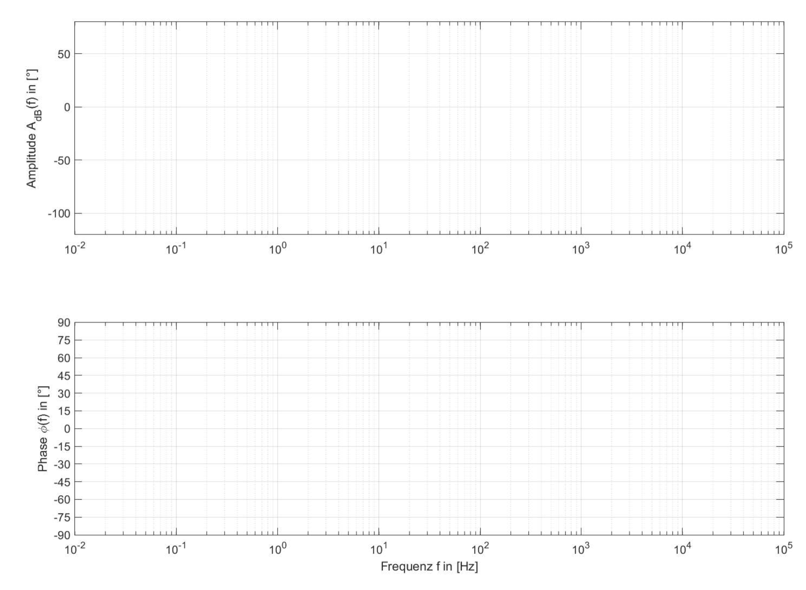

# Bode-Diagramm

Zur Darstellung von Übertragungsverhalten werden Bode-Diagramme zur Darstellung des Frequenzgangs benutzt. Durch die logarithmische Darstellung der Amplitudenverhältnisse lassen sich aus mehreren Übertragungssystemen zusammengesetzte Systeme leichter analysieren.
Die logarithmische Darstellung bildet nämlich die Multiplikation der einzelnen Funktionen auf eine einfache Addition ab.

Es sei folgendes Übertragungssystem gegeben:

```{figure} pictures/bode.png
:class: .dark-light
---
height: 150px
name: optional-label
---
Übertragungssystem mit vier Gliedern.

```


welches aus einem P-Glied, einem D-Glied, einem PT1-Glied und einen PD-Glied besteht. 

$$H_1 = 10$$

$$H_2 = s$$

$$H_3 = \frac{1}{1+\frac{s}{4}}$$

$$H_4 = 1+\frac{s}{60}$$

Erstellen Sie das Bode-Diagramm, indem Sie die Amplitudengänge in dB eintragen und anschließend grafisch addieren. Analog erstellen Sie das Phasengang-Diagramm. 




````{tip}
:class: dropdown
Was gilt für die Hintereinanderschaltung von Messsystemen im Laplace, bzw. Frequenzbereich? Schreiben Sie die Gesamt-Übertragungsfunktion hin.

<iframe width="560" height="315" src="https://www.youtube.com/embed/cQH--8rpRw8?si=uPyVg9Jesb0BtUJU" title="YouTube video player" frameborder="0" allow="accelerometer; autoplay; clipboard-write; encrypted-media; gyroscope; picture-in-picture; web-share" allowfullscreen></iframe>
````