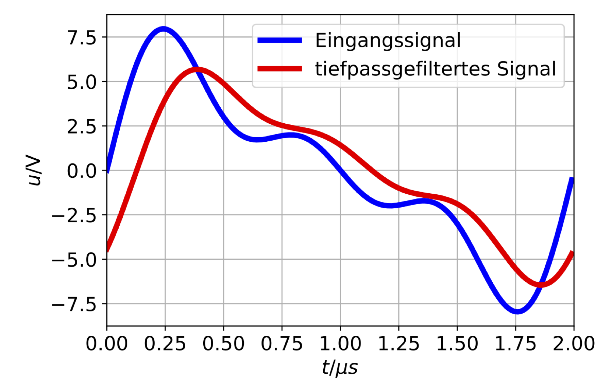

# Passiver RC-Tiefpass 1. Ordnung

Ein Messgerät mit einem Verzögerungsverhalten 1. Ordnung, also einem Tiefpassverhalten, und einer 3dB-Grenzfrequenz von $f_0 = 1\,\mathrm{MHz}$ wird mit einem periodischem Spannungssignal beaufschlagt. 

```{figure} pictures/tiefpass_3sin_schaltung.png
:class: .dark-light
---
height: 150px
---
Passiver RC-Tiefpass 1. Ordnung
```

Die Spannung wird durch die Überlagerung von drei sinusförmigen Spannungen generiert:

$$u_{11}(t) = 6\,\mathrm{V} \sin(2 \pi \cdot 5 \cdot 10^5\,\mathrm{s^{-1}} \cdot t) $$

$$u_{12}(t) = 5\,\mathrm{V} \sin(2 \pi \cdot 1 \cdot 10^6\,\mathrm{s^{-1}} \cdot t) $$

$$u_{13}(t) = 3\,\mathrm{V} \sin(2 \pi \cdot 1{,}5 \cdot 10^6\,\mathrm{s^{-1}} \cdot t) $$



Berechnen Sie die Ausgangsspannungen (inkl. Phasen) und skizzieren Sie das Amplitudenspektrum für Eingangs- und Ausgangssignal in einem Diagramm.
Wie hoch darf die Frequenz eines Messsignals höchstens sein, wenn der frequenzabhängige Amplitudenabfall kleiner als 1% sein soll? 


