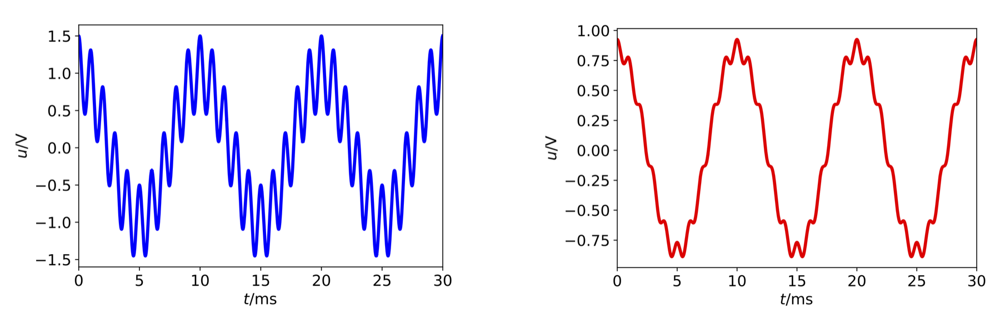

# Signal-Rausch-Verhältnis bei einer Tiefpass-Filterung

Die Güte eines Signals wird in der Systemtheorie über ein Signal-Rausch-Verhältnis (Signal-Noise-Ratio SNR) beschrieben. 
Es ist definiert als das Verhältnis der mittleren Nutzsignalleistung zur mittleren Rauschsignalleistung:

$$\mathrm{SNR} = \frac{P_\mathrm{Signal}}{P_\mathrm{Rauschen}}$$

In dieser Aufgabe wird untersucht, wie ein Tiefpass-Filter das Signal-Noise-Ratio (SNR) verbessern kann. Dazu wird das harmonische Signal 

$$u_1(t) = 1\,\mathrm V \cos(2\pi\cdot 100\,\mathrm{Hz} \cdot t)$$

angenommen. 

Das Signal ist mit einer harmonischen Störung 

$$u_2(t) = 0{,}5\,\mathrm V \cos(2\pi \cdot 1\,\mathrm{kHz} \cdot t)$$

überlagert.

Wie lauten die komplexen Koeffizienten $\underline c_k$ der beiden Signale? Berechnen Sie die mittlere Leistung $P$ mithilfe der Fourier-Koeffizienten und dem **Parseval'schen Theorem**:

$$ P =  |c_0|^2 + 2 \cdot \sum_{k = 1}^N |\underline c_k|^2$$

Geben Sie das Signal-Noise-Ratio SNR an.
 
Die Summe der beiden Signale wird von einem RC-Tiefpass gefiltert. Geben Sie die Fourier-Koeffizienten nach der Filterung an. Berechnen Sie das SNR nach einem Tiefpass mit einem Widerstand von $R = 100\,\mathrm{k\Omega}$ und einer Kapazität von $C = 10\,\mathrm{nF}$. Um welchen Faktor hat sich das SNR verbessert? Skizzieren Sie das Spektrum aller Fourier-Koeffizienten.
