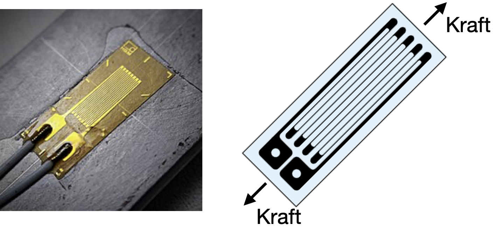

# Bestimmung des Drehmomentes einer Welle

Das Drehmoment einer Welle wird mit Hilfe der DMS-Messtechnik gemessen. Dehnungsmessstreifen (DMS) ändern aufgrund einer relativen Längenänderung $\epsilon = \frac{\Delta L}{L}$ ihren Widerstandswert $R(\epsilon) = k\epsilon$. 
Der $k$-Faktor beträgt hier 2,01 und der Widerstand beträgt $300\,\Omega$. DMS messen entlang einer Achse Längenänderung. 



In dieser Aufgaben sollen DMS benutzt werden, um das Drehmoment einer Welle zu bestimmen. 
Sie können entsprechend der Skizze die DMS unter einem Winkel von 45 Grad zur Längsachse der Welle anbringen. Die DMS der +45 Grad-Linie werden dadurch um $+\epsilon$ gedehnt und die der -45 Grad-Linie werden betragsmäßig gleich groß um $-\epsilon$ gestaucht. 


Die Welle hat einen Durchmesser $D = 3{,}1\,\mathrm{cm}$, einen Elastizitätsmodul $E = 20{,}5 \cdot 10^{4}\,\mathrm{N/mm^{2}}$ und eine Querdehnungszahl von $\mu = 0{,}31$. Es wird eine Wheatstonesche Messbrücke mit Gleichstromspeisung verwendet, die im Ausschlagverfahren arbeitet und mit einer Gleichspannung von $U = 3{,}5\,\mathrm V$ versorgt wird. Zwischen Drehmoment $M_{D}$ und Dehnung $\varepsilon$ besteht folgende Beziehung:

$$M_{D} = \frac{E \pi D^{3} \epsilon}{16 (1+\mu)}$$

Die Formel für die Diagonalspannung $U_{d}$ in Abhängigkeit von $\epsilon$ ist:

$$U_{d} = \frac{1}{2}U_{0}k \epsilon$$

1. Die Brücke soll abgeglichen sein, wenn kein Drehmoment angreift. Wie groß sind die übrigen beiden Widerstände der Messbrücke?

```{tip}
:class: dropdown
Für den Abgleich gilt $U_d = 0$ und somit

$$\frac{R_1}{R_2} = \frac{R_3}{R_4}$$
```

2. Ist die von Ihnen gewählte Messbrücke temperaturkompensiert?

```{tip}
:class: dropdown
Vergleichen Sie hierfür die Anschaltung der DMS mit der Aufgabe [Ausschlagsmessbrücke]{Aussschlag-Messbrücke.md}.
```


3. Wie groß ist der in einem der beiden DMS fließende Strom?

```{tip}
:class: dropdown
Benutzen Sie ohm'sches Gesetz und betrachten Sie die Masche ganz linka:

$$U_ 0 = RI$$

Wie berechnet sich $R$, bestehend aus einer Reihenschaltung der beiden DMS?
```

4. Wie groß ist das Drehmoment, wenn eine Brückenausgangsspannung von $880\,\mathrm{\mu V}$ angezeigt wird?

```{tip}
:class: dropdown
Formen Sie die Gleichung $U_{d} = \frac{1}{2}U_{0}k \epsilon$ nach $\epsilon$ um und setzen sie die in die Gleichung für $M_D$ ein. Setzen Sie alle Werte ein. ($M_D = 229\,\mathrm{Nm}$)
```


5. Welcher relative Maximal-Fehler ergibt sich für das unter d) ermittelte Drehmoment, wenn der Wellendurchmesser einen Fehler von $\pm 0,2\,\mathrm{mm}$ aufweist und die Brückenspeisespannung auf $\pm 3$\% stabilisiert ist? Die übrigen Elemente der Messbrücke seien fehlerfrei. 

```{tip}
:class: dropdown
Für den absoluten Maximalfehler gilt:

$$\Delta y = \left| \frac{\partial y}{\partial x_1} \right| \cdot \Delta x_1+ \left|\frac{\partial y}{\partial x_2} \right| \cdot \Delta x_2 + \cdots$$

Spezialfall: Bei Multiplkation/Division addieren sich die *relativen* Messabweichungen und es folgt für den relativen Fehler:

$$\pm \frac{\Delta M_D}{M_D} = 3 \cdot \frac{\Delta D}{D} + \frac{\Delta U_0}{U_0} = 4{,}935\%$$
```

6. Wie groß ist der absolute Maximal-Fehler?

```{tip}
:class: dropdown

$$ \Delta M_D = 11{,}3\,\mathrm{Nm}$$
```
