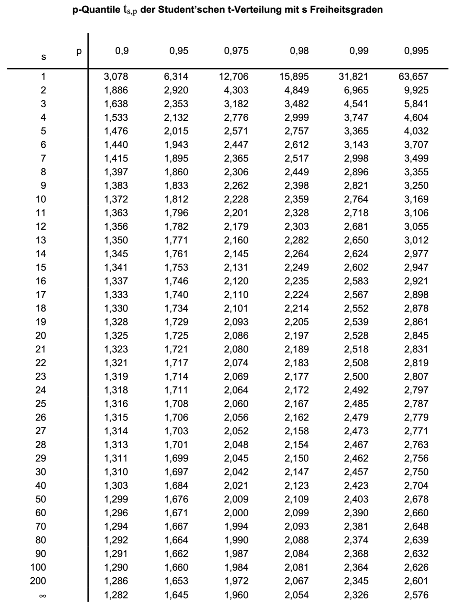

# Kolbenmanometer

Ein Kolbenmanometer, auch als Druckwaage bezeichnet, ist ein Instrument, mit welchem in einer Flüssigkeit oder einem Gas ein definierter Druck dargestellt werden kann, indem auf einen Kolben mit bekanntem Querschnitt eine definierte Kraft ausgeübt wird. In der Praxis werden hierzu auf den Kolben Massestücke aufgelegt, welche im Schwerefeld der Erde eine Gewichtskraft auf den Kolben ausüben. 

```{figure} pictures/kolbenmanometer.png
:class: .dark-light
---
height: 150px
name: optional-label
---
Prinzipskizze eines Kolbenmanometers

```

Der infolge der Gewichtskraft der Massestücke im Medium herrschende Druck $p$ kann durch folgenden formelmäßigen Zusammenhang angegeben werden:

$$ p = \frac{4 \cdot M \cdot g}{\pi \cdot D^2}$$

Hierin ist $M$ die Gesamtmasse aller aufgelegten Massestücke, $g$ ist die am Versuchsstandort herrschende Fallbeschleunigung und $D$ ist der Durchmesser des kreisförmigen Kolbenquerschnitts. Die Gesamtmasse $M$ wird hierbei durch Auflegen von insgesamt $k$ Massestücken der Einzelmasse $m$ erzeugt.

Im Folgenden soll der Druck $p$ auf der Grundlage von Messergebnissen für die Größen $m{,}$ $D$ und $g$ einschließlich der wahrscheinlichen Abweichungsgrenzen ermittelt werden.

Die verfügbaren Massestücke weisen jeweils eine Einzelmasse $m$ auf, die vom Hersteller mit $m = 5{,}\mathrm{kg} \pm 0{,}001\mathrm{kg}$ bei $P = 98\%$ angegeben wird. Im hier betrachteten Betriebspunkt werden zur Darstellung der Gesamtmasse $M$ insgesamt $k = 9$ dieser als voneinander unabhängig anzusehenden Massestücke aufgelegt.

Die Fallbeschleunigung $g$ an den möglichen Versuchsstandorten innerhalb der Gravitationszone 4 wurde anhand einer sehr großen Zahl von Datenbankwerten im Vorfeld mit $g = 9{,}813\mathrm{m/s^2} \pm 0{,}0015\mathrm{m/s^2}$ bei $P = 95\%$ abgeschätzt.

Der Kolbendurchmesser $D$ wurde bei der Herstellung des Kolbenmanometers zehnmal gemessen. Dabei ergaben sich die in Tabelle \ref{tb:1} zusammengefassten Einzelmesswerte:

| $i$ |  1     |  2     |  3     |  4     |  5     |  6     |  7     |  8     |  9     |  10    |
|-----|--------|--------|--------|--------|--------|--------|--------|--------|--------|--------|
| $D /\mathrm{mm}$ | 20{,}001 | 19{,}998 | 19{,}999 | 20{,}001 | 20{,}002 | 19{,}998 | 20{,}002 | 19{,}998 | 19{,}997 | 20{,}003 |

Berechnen Sie den gesuchten Druck $p$ und geben Sie das vollständige Messergebnis mit einer Aussagewahrscheinlichkeit von $P = 98\%$ an!

*Hinweis: Für alle Messgrößen kann eine Normalverteilung vorausgesetzt werden.*




