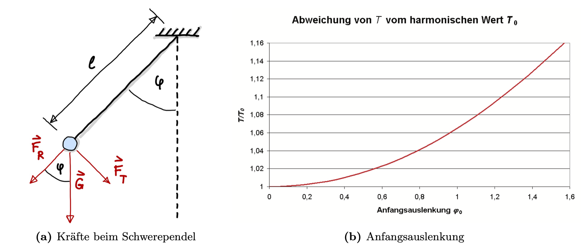

# Das Schwerependel 

**Grundlagen für das Praktikum und Fehlerfortpflanzung.**

```{button-link} https://kisleif.github.io/mtbook/content/T_Schwerependel.html
:color: primary
Hier geht's zur Lösung (Jupyter-Notebook)
```


```{figure} pictures/schwerependel.jpeg
---
height: 250px
name: schwerependel
---

```

In der Vorlesung haben wir das Schwerependel behandelt und die Periodendauer gemessen. Hieraus soll nun die Erdbeschleunigung $g$ inklusive Messunsicherheit im Vorlesungssaal bestimmt werden.  
Eine Masse $m$ wird um den Winkel $\varphi_0$ ausgelenkt. Losgelassen pendelt sie mit der Periodendauer $T$. Für kleine Auslenkungen $\varphi$ gilt die Näherung in Abb. \ref{fig:pendel} und man erhält für $T$:

$$
	T^2 = \frac{(2\pi)^2}{g}\cdot l

$$

wobei $l$ die Pendellänge ist und $g$ die Erdbeschleunigung (auch Ortsfaktor genannt).




## Grundlagen

### Statistik

Im Vorlesungs-Kapitel [Messunsicherheiten](https://kisleif.github.io/mtbook/content/1_Messunsicherheiten.html) befinden sich alle wichtigen Formeln zur Berechnung der Messunsicherheiten und der Fehlerfortpflanzung. Wenn $x_{j}$ die Einzelmesswerte einer Messreihe sind und $m$ der Stichprobenumfang (= Anzahl der Messwerte in der Messreihe), dann gilt für den Mittelwert:

$$\overline x = \frac{1}{m}\sum_{j=1}^m x_j$$

Für empirische Daten lautet die Varianz:

$$s^2 = \frac{1}{m-1} \sum_{j=1}^m (x_j - \overline x)^2$$


und die empirische Standardabweichung $s(x)$ der Einzel-Messwerte:

$$s = \sqrt{\frac{1}{m-1} \sum_{j=1}^m (x_j - \overline x)^2}$$

Für die Standardabweichung des Mittelwertes gilt:

$$s(\overline x) = \frac{s}{\sqrt{m}} = \sqrt{\frac{1}{m(m-1)} \sum_{j=1}^m (x_j - \overline x)^2}$$

### Vertrauensbereich

Für die erweiterte Messunsicherheit mit Vertrauensbereich wird die Standardabweichung mit dem Erweiterungsfaktor $t$ multipliziert (hier angegeben für die Messunsicherheit des Mittelwertes, daher der Faktor $1/\sqrt{m}$):

$$u_{\overline x} = \pm \frac{t}{\sqrt{m}}\cdot s(x) = \pm t \cdot s(\overline x)$$

Dieser ist ein Maß für den Vertrauensbereich, indem sich eine bestimmte Anzahl von Messwerten befinden:

* 68,3\% aller Messwerte liegen im Bereich $\pm \sigma$
* 95,5\% aller Messwerte liegen im Bereich $\pm 2\sigma$
* 99,7\% aller Messwerte liegen im Bereich $\pm 3\sigma$


Diese Werte gelten für die Normalverteilung. Bei kleinen Stichproben, $m < 25$, muss die Student-t-Verteilung angewendet werden, mittels welcher das Quantil $t$ bestimmt wird und  der Vertrauensbereich angepasst wird (siehe Tabelle im Anhang).  

### Fehlerfortpflanzung

Angenommen es liegen mehrere Messreihen für verschiedene physikalische Größen vor, $x_{1}$ und $x_{2}$ ,..., aus denen die Größe $y$ mittels funktionalem Zusammenhang ermittelt werden soll, $y = f(x_{1}, x_{2}, ...)$, dann gilt für die Messabweichung von $y$ laut Gauß'schem Fehlerfortpflanzungsgesetz:

$$u_y = \sqrt{\left (\frac{\partial y}{\partial x_1} \cdot u_1 \right)^2 +\left (\frac{\partial y}{\partial x_2} \cdot u_2 \right)^2 +\cdots}$$

Dies gilt, wenn es sich bei mindestens einer Unsicherheit von $u_{1}$ oder $u_{2}$ um eine statistische Messunsicherheiten handelt. Andernfalls sollte der Maximalfehler berechnet werden. 

## Aufgaben

### Schrecksekunde - [Statistische Messunsicherheit](https://kisleif.github.io/mtbook/content/1_StatistischeMessunsicherheit.html)

Miss deine persönliche Schrecksekunde indem du 5 mal versuchst bei genau 5s deine Stoppuhr anzuhalten.
Berechne hieraus die Standardabweichung, um die Messunsicherheit für deine persönliche Einzelmessung zu erhalten. 
Miss die Perdiodendauer des Pendels und das Ergebnis der Periodendauer inklusive Messunsicherheit an. 

### Pendellänge - [Systematische Messunsicherheit](https://kisleif.github.io/mtbook/content/1_SystematischeMessabweichung.html)

Miss die Pendellänge und gib die Messunsicherheit dazu an. Begründe dein Ergebnis. 

### Erdbeschleunigung - [Fehlerfortpflanzung](https://kisleif.github.io/mtbook/content/1_Fehlerfortpflanzung.html)

Bestimme aus den oben berechneten besten Schätzwerten für die Periodendauer $\overline T$ und die Pendellänge $\overline l$ mittels der Pendelgleichung

$$
	T^2 = \frac{(2\pi)^2}{g}\cdot l

$$

die Erdbeschleunigung $g$.
Bestimme außerdem die Messunsicherheit mittels Fehlerfortpflanzung. 
Gebe das Ergebnis für einen Vertrauensbereich von 99,7% an. 

### Pendellänge - Diagramm zeichnen
Miss für verschiedene Pendellängen $l$ die Periodendauer $T$. Trage $T^{2}$ gegenüber $l$ in ein Diagramm ein. Trage auch die Fehlerbalken in das Diagramm ein. Bestimme die Erdbeschleunigung mittels einer linearen Regression.


```{button-link} https://kisleif.github.io/mtbook/content/T_Schwerependel.html
:color: primary
Hier geht's zur Lösung (Jupyter-Notebook)
```


```{figure} pictures/student-t.png
---
height: 300px
name: optional-label
---
Für die Freiheitsgrade $s$ und $p$ gilt:  $s = m-1$, wobei $m$ die Größe der Stichprobe ist. $p = 1- \alpha/2$, wobei $\alpha$ das Signifikanzniveau angibt.

```


    
